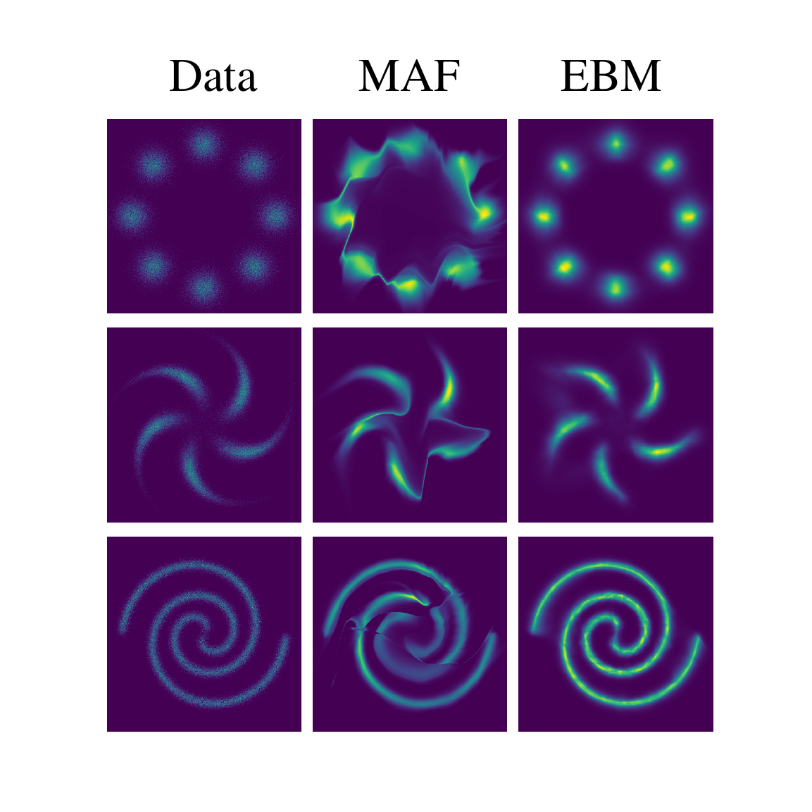
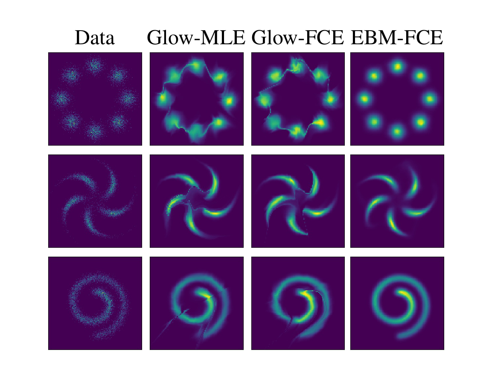
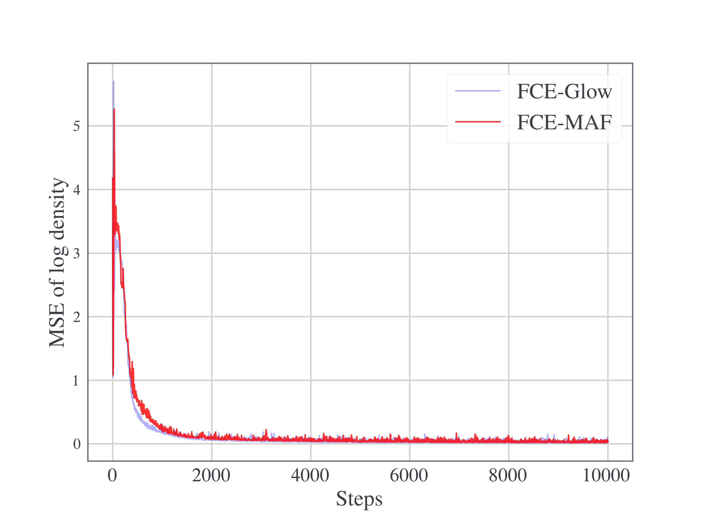
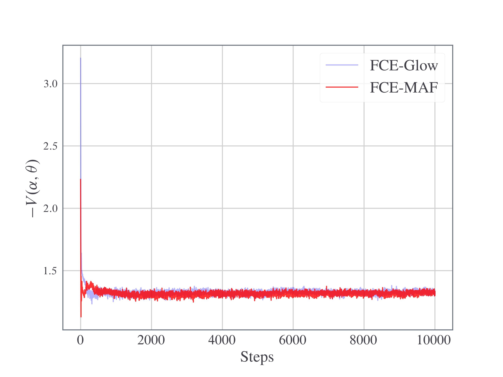
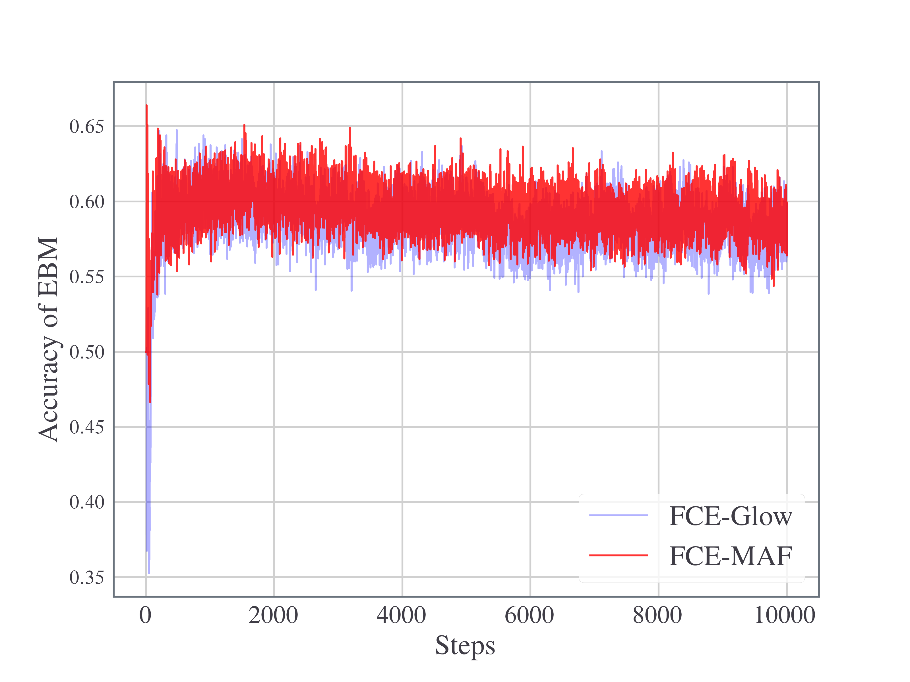

# Flow Contrastive Estimation (FCE)

This is an implementation of [Flow Contrastive Estimation](https://openaccess.thecvf.com/content_CVPR_2020/html/Gao_Flow_Contrastive_Estimation_of_Energy-Based_Models_CVPR_2020_paper.html) in PyTorch on 2D dataset.

## Introduction

### Direct Estimation of Energy Model is Difficult

Our problem is to estimate an energy based model (EBM)

$$p\_\theta(x) = \frac{\exp[-f\_\theta(x)]}{Z(\theta)}$$

where 

$$Z(\theta) = \int\exp[-f\_\theta(x)]dx$$

is the normalizing constant. The energy model specifies a probability distribution on data space. The normalizing constant is very difficult to calculate since we have to sum over an exponential number of configurations. 

The energy based model is implemented in file [ebm.py](ebm.py).

### NCE: Teach EBM to Classify Data and Noise

One approach to estimate EBM is through [Noise Contrastive Estimation (NCE)]( http://proceedings.mlr.press/v9/gutmann10a/gutmann10a.pdf ). In NCE, the normalizing constant is treated as a trainable parameter, and the model parameters are estimated by training the EBM to classify data and noise. Let $p\_{\mathrm{data}}(x)$ denote data distribution and let $q(x)$ denote some noise distribution. This amounts to maximize the following posterior log-likelihood of the classification:

$$V(\theta) = \mathbb{E}\_{x\sim p\_{\text{data}}}\log\frac{p\_\theta(x)}{p\_\theta(x)+q(x)} + \mathbb{E}\_{\tilde{x}\sim q}\log\frac{q(\tilde{x})}{p\_\theta(\tilde{x}) + q(\tilde{x})}.$$

### FCE: Replace Noise in NCE with Flow Model

In Flow Contrastive Estimation (FCE), we replace the noise $q(x)$ with a flow model $q_\alpha(x)$, and jointly train the two models by iteratively maximizing and minimizing the posterior log-likelihood of the classification:

$$V(\alpha,\theta) = \mathbb{E}\_{x\sim p\_{\text{data}}}\log\frac{p\_\theta(x)}{p\_\theta(x)+q\_\alpha(x)} + \mathbb{E}\_{\tilde{x}\sim q\_\alpha}\log\frac{q\_\alpha(\tilde{x})}{p\_\theta(\tilde{x}) + q\_\alpha(\tilde{x})}.$$

This objective is implemented as the `value` function in file [util.py](util.py). 

When the classification accuracy is below a threshold, the energy model is trained. Otherwise, the flow model is trained.

In the paper, the authors choose [Glow](https://arxiv.org/abs/1807.03039) as the flow model. In this repository we implemented both Glow and [MAF](https://arxiv.org/abs/1705.07057) as the flow model.

## Training

To train the model, do

```shell
python train.py
```

| Argument               | Meaning                                                                                                                          |
| ---------------------- | -------------------------------------------------------------------------------------------------------------------------------- |
| `--seed=42`            | random seed                                                                                                                      |
| `--epoch=100`          | training epoch                                                                                                                   |
| `--flow=glow`          | `glow` or `maf` to use as the flow model                                                                                         |
| `--threshold=0.6`      | threshold for alternate training                                                                                                 |
| `--batch=1000`         | batch size                                                                                                                       |
| `--dataset=8gaussians` | Available datasets:<br />- `8gaussians`<br />- `spiral`<br />- `2spirals`<br />- `checkerboard`<br />- `rings`<br />- `pinwheel` |
| `--samples=500000`     | training set size                                                                                                                |
| `--lr_ebm=1e-3`        | Adam learning rate for EBM                                                                                                       |
| `--lr_flow=7e-4`       | Adam learning rate for Flow model                                                                                                |
| `--b1=0.9`             | Adam gradient decay                                                                                                              |
| `--b2=0.999`           | Adam gradient decay                                                                                                              |

### Install wandb

To run the script you need to install [Weights & Biases (wandb)](https://wandb.ai/site). It is an MLOps tool used to monitor the metrics during training. I find it very easy and convenient to use, and I encourage you to install and have a try as well. 

First, sign up on their website https://wandb.ai/site. You may use your GitHub account to sign up. Copy your API key.

Next, install the Python package through

```shell
pip install wandb
```

When you start running your experiment, you may be asked to login. You simply paste your API key and hit enter. Now that the experiment is running, you can go to https://app.wandb.ai/home and visualize your experiment in real time.

Otherwise, if you do not wish to use it, you can comment out all the `wandb` part in [train.py](train.py).

## Visualizations

### Density Plots

The figure below shows result of Flow Contrastive Estimation, using MAF as the flow model. The left column has three data distributions. The middle column shows densities learned by MAF. Note that they are also the densities that the energy model is trying to distinguish from the true densities. The right column shows densities learned by EBM.



For reference, here is the result presented in the FCE paper, showing learned Glow and EBM densities on three data distributions.



### MSE

In case of the 8 Gaussian dataset, we have an analytical formula for the true data distribution. We can evaluate the MSE of the log density learned by the energy model versus the true data distribution. The plot below shows the MSE on the `8gaussians` training dataset. 



### Value

The figure below shows the negative of the value function during training. If both EBM $p_\theta$ and Flow $q\_\alpha$ are close to the data distribution $p_{\text{data}}$, then $p\_\theta\approx q\_\alpha\approx p\_{\text{data}}$ and the value should be approximately

$$- V(\alpha,\theta)\approx -\left(\log\frac{1}{2}+\log\frac{1}{2}\right) = \log4 \approx 1.39.$$



### Accuracy

In our experiment we choose `0.6` as the default threshold, and as we can see the classification accuracy of the EBM fluctuates around 0.6.



## Reference

Gao, Ruiqi, et al. "Flow contrastive estimation of energy-based models." *Proceedings of the IEEE/CVF Conference on Computer Vision and Pattern Recognition*. 2020.